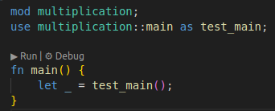
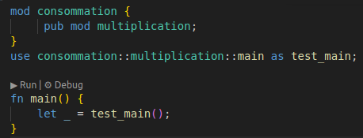
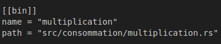

# Description

Ce projet contient tous les artifacts (code source, scripts, résultats, figures, données utilisées) développés et obtenus durant l'étude menée sur l'impact de l'utilisation des flottants avec les opérations homomorphes en TFHE sur les performances de cet algorithme. 

Le code source est organisé selon les critères de mesure utilisés : précision des calculs, temps d'exécution, consommations mémoire et énergétique.

# Usage

Ce projet contient plusieurs fichiers de mesures. Pour en utiliser un, il existe deux méthodes:
- Passer par le fichier _main.rs_ 
- Exécuter directement le binaire du fichier

En passant par le fichier _main.rs_, il faut: 
- Déclarer la fonction _main_ dans le fichier comme publique (`pub fn main`)
- Déclarer le fichier comme module dans le fichier _main.rs_ et faire appel à sa fonction _main_

Si le fichier à exécuter est dans un autre dossier, voici comment faire:
  

Dans ce cas, la commande `cargo run --release` exécutera le _main.rs_ et par la suite le fichier souhaité.

Pour exécuter directement le binaire du fichier, il faut ajouter dans _Cargo.toml_ une déclaration pour que ce binaire peut être construit. Voici un exemple:

L'exécution sera ensuite faite par la commande `cargo run --bin multiplication --release`.

:warning: La présence d'une déclaration d'un binaire en _Cargo.toml_ implique l'utilisation obligatoire de la deuxième méthode.